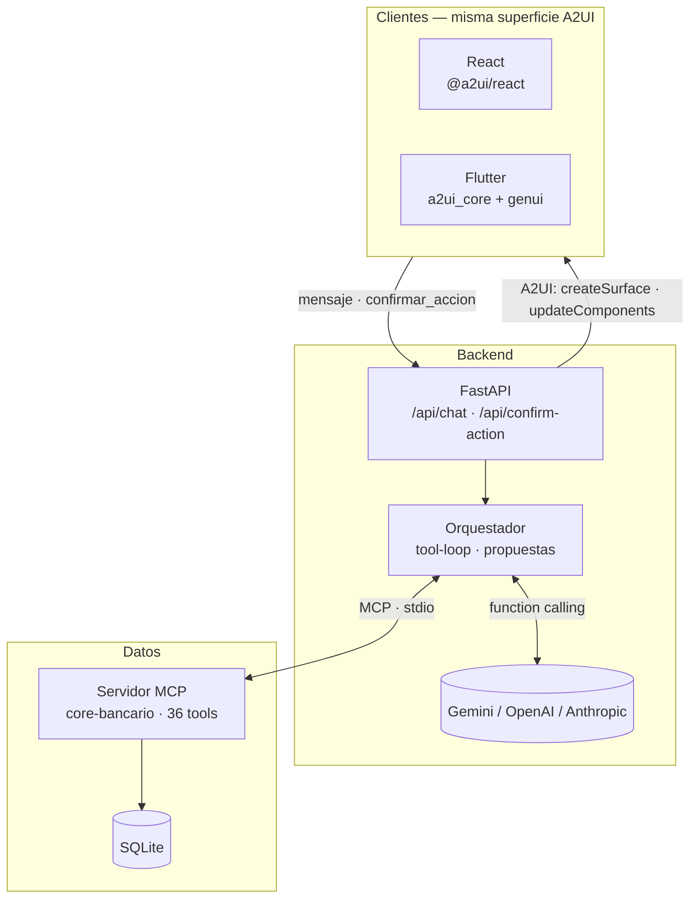

# Me alcanza

**¿Me alcanza para X?** — un agente que no responde con texto: simula tu flujo de caja, te muestra el veredicto en una tarjeta y, si no alcanza, te propone un apartado de ahorro que se activa con un toque. La acción ocurre de verdad en la cuenta.

Reto *Interfaces que la IA construye en tiempo real* — Banorte × Tec de Monterrey, HackMTY 2026.

| | |
|---|---|
| **LLM** | Gemini, OpenAI o Anthropic Claude intercambiables por `LLM_PROVIDER` (mismo tool-loop, cero cambios al orquestador — [ADR 0022](docs/adr/0022-adaptador-openai-sin-tocar-el-orquestador.md), [ADR 0023](docs/adr/0023-tercer-adaptador-anthropic-claude.md)) |
| **MCP** | Servidor propio `core-bancario` sobre stdio — 36 tools, SQLite sembrado |
| **A2UI** | Protocolo v0.9 (`a2ui-agent-sdk`), **catálogo propio** (`StatCard`/`BarChart`/`PlanDePago`/`LineChart`/`ApartadoPlanner` + primitivos base — [ADR 0011](docs/adr/0011-a2ui-con-catalogo-basico-del-sdk.md)); la misma superficie se renderiza en **React** y en **Flutter** |
| **Tests** | 280 en Python (backend + MCP) · 81 en React · 66 en Flutter |

---

## El flujo en 30 segundos

```
Ana escribe:  "¿me alcanza para el concierto del 13 de octubre?"
              │
              ▼
Agente:       get_metas → simular_flujo_de_caja(fecha, $8,000)
              │   saldo $500 · nómina +$12,500 · gastos fijos −$5,570 · margen −$570
              ▼
Tarjeta:      "No alcanza por $570"  ·  ¿Cómo se calculó? (modal con los montos)
              [ Activar apartado: $142.50 semanales × 4 ]  ← Button → confirmar_accion
              │
              ▼  el usuario toca
Backend:      valida la propuesta → crear_apartado (MCP) → descuenta $142.50 del saldo
              │
              ▼
Tarjeta:      "Apartado activado"  — el saldo ya cambió en /api/cuenta
```

El LLM nunca calcula dinero: la simulación es una función pura determinista ([`cashflow.py`](src/me_alcanza/mcp_bank/cashflow.py)). El LLM decide *qué mostrar*; el motor decide *cuánto*.

Segundo flujo: *"deposítale 500 a mi hermano Pepe"* → hay dos "Pepe" → el agente genera **dos tarjetas de confirmación** en el mismo turno y el usuario desambigua tocando la correcta.

Tercer flujo: el motor detecta de forma **100% determinista** (nunca el LLM — [ADR 0019](docs/adr/0019-sugerencias-proactivas-sin-llm.md)) riesgos de liquidez, gastos próximos, metas en riesgo y picos de gasto por categoría contra el promedio real de la cuenta. Todo aparece en la pestaña **Atención**, cada uno con su propio `StatCard`/`BarChart` y un botón "Atender" que abre un modal HITL — desde ahí se puede pedir, bajo demanda, una propuesta de solución generada por el LLM a partir de esos mismos hechos (nunca automática, nunca inventa cifras).

---

## Arquitectura



| Capa | Qué hace | Dónde |
|---|---|---|
| Orquestador | Arma el system prompt con el catálogo A2UI, corre el tool-loop (máx. 5 rondas), reescribe `surfaceId` por turno, convierte propuestas en tarjetas | [`orchestrator.py`](src/me_alcanza/backend/orchestrator.py) |
| Propuestas | Toda mutación pasa por *proponer → confirmar*. La propuesta vive en memoria 5 min, atada a la cuenta, y se descarta **antes** de ejecutar (una confirmación doble no ejecuta dos veces) | [`proposals.py`](src/me_alcanza/backend/proposals.py) |
| Servidor MCP | Un proceso aparte, hablado por stdio con el SDK oficial. Cada tool abre/cierra su conexión; los errores de negocio viajan como `ToolError` y llegan al cliente como `400` con el mensaje intacto | [`server.py`](src/me_alcanza/mcp_bank/server.py) |
| Motores | Simulación de flujo de caja, reglas de sugerencias, score de salud — funciones puras sin I/O, testeadas con fixtures sintéticos | [`cashflow.py`](src/me_alcanza/mcp_bank/cashflow.py) · [`sugerencias_engine.py`](src/me_alcanza/mcp_bank/sugerencias_engine.py) |
| Datos | Schema + seed relativo a *hoy* (para que la demo dispare siempre), auth PBKDF2, JWT | [`db.py`](src/me_alcanza/mcp_bank/db.py) · [`auth.py`](src/me_alcanza/backend/auth.py) |

### Cómo cierra el ciclo (proponer → confirmar → mutar)


---

## Correrlo

**Backend** (Python ≥ 3.14, [uv](https://docs.astral.sh/uv/)):

```bash
cp .env.example .env        # ver "Elegir proveedor de LLM" abajo
uv sync --all-groups
uv run me-alcanza           # http://localhost:8000
```

**Frontend web** (Node):

```bash
cd frontend
cp .env.example .env        # VITE_API_BASE_URL=http://localhost:8000
npm install && npm run dev  # http://localhost:5173
```

### Elegir proveedor de LLM

`LLM_PROVIDER` en `.env` acepta `gemini` (default), `openai`, `anthropic` o
`fake` (modo offline determinista, sin llamar a ningún LLM real — arranca
el backend aunque no haya API key). El orquestador no sabe ni le importa
cuál está activo: los tres adaptadores exponen la misma superficie mínima
([ADR 0022](docs/adr/0022-adaptador-openai-sin-tocar-el-orquestador.md),
[ADR 0023](docs/adr/0023-tercer-adaptador-anthropic-claude.md)).

```bash
LLM_PROVIDER=gemini
GOOGLE_AI_STUDIO_API_KEY=...
GEMINI_MODEL=gemini-2.0-flash        # default

LLM_PROVIDER=openai
OPENAI_API_KEY=...
OPENAI_MODEL=gpt-4o-mini             # default

LLM_PROVIDER=anthropic
ANTHROPIC_API_KEY=...
ANTHROPIC_MODEL=claude-opus-5        # default
```

### Docker (backend + frontend, para el homelab)

Ya existe la arquitectura completa en [`docker-compose.yml`](docker-compose.yml) —
solo hace falta el `.env` con las variables de arriba en la raíz del repo:

```bash
cp .env.example .env        # completar las keys del proveedor elegido
docker compose up -d --build
```

- Backend: puerto `10000`, DB en volumen (`banco-db`, persiste entre reinicios).
- Frontend: puerto `8080`, build estático servido por nginx.
- `VITE_API_BASE_URL` (en `.env`) se hornea en el build del frontend y
  debe ser una URL que el **navegador** del cliente pueda resolver (IP
  o hostname del homelab, tailnet, etc.) — no `backend`, que solo
  existe dentro de la red de docker compose.
- **Cualquier cambio a `pyproject.toml` o a `frontend/package.json`
  exige reconstruir la imagen** (`docker compose up -d --build`), no solo
  reiniciar el contenedor — si el arranque falla con un
  `ModuleNotFoundError`/`Cannot find module`, es casi siempre esto.
- Para levantar solo uno de los dos: `docker compose up -d --build backend`
  o `docker compose up -d --build frontend`.
- Para bajar todo (útil si un contenedor viejo dejó un puerto ocupado):
  `docker compose down`.

**Flutter** (Android): `cd flutter_app && flutter run`. El emulador llega al host por `10.0.2.2:8000`; contra el backend público, `--dart-define=API_BASE_URL=https://homelab.tail8dc7f1.ts.net`. Detalle en [`flutter_app/README.md`](flutter_app/README.md).

### Desplegado

| | URL | Cómo |
|---|---|---|
| Frontend | https://frontend.jzackarias.lat/ | nginx en el homelab, detrás de Cloudflare |
| Backend | https://homelab.tail8dc7f1.ts.net/ | uvicorn en el homelab, publicado con Tailscale Funnel (`/docs` tiene el Swagger) |

Por qué así y qué se aceptó a cambio: [ADR 0017](docs/adr/0017-self-hosting-en-homelab-con-docker-compose.md) y [ADR 0018](docs/adr/0018-exposicion-publica-tailscale-funnel-y-cloudflare.md).

### Cuentas demo

| Usuario | Password | Perfil |
|---|---|---|
| `ana` | `pass123` | $500 de saldo, nómina quincenal mañana, 4 gastos fijos en 3–4 días, meta "Concierto" a 32 días, dos contactos "Pepe" |
| `luis` | `pass456` | $8,200, sin ingresos ni gastos programados |
| `jesus` | `mty123` | $3,200, nómina quincenal en 4 días, renta + internet, meta "Laptop nueva" a 90 días, un contacto (Ana) |

El seed usa fechas **relativas a hoy**: la demo dispara igual el día que sea.

### Qué preguntarle

| Mensaje | Qué genera |
|---|---|
| *¿me alcanza para el concierto del 13 de octubre?* | Veredicto + `LineChart` con la proyección de saldo día a evento (punto crítico marcado) + `ApartadoPlanner` interactivo si no alcanza |
| *deposítale 500 a mi hermano Pepe* | Dos tarjetas de confirmación (desambiguación por toque) |
| *¿en qué gasté este mes?* | Resumen por categoría en `BarChart`, con `tone` de advertencia en las categorías donde `detectar_picos_gasto` encontró un pico real |
| *¿cómo ando de finanzas?* | `StatCard` con el score 0–100 de salud financiera y sus factores |
| *agrega a Sofi como contacto, cuenta 5566778899* | Tarjeta de confirmación → `crear_contacto` |
| Pestaña **Atención** → botón "Atender" en cualquier notificación | Modal HITL con los hechos deterministas + botón "Ver propuesta del asistente" (LLM, bajo demanda) |

---

## Herramientas MCP

Las 36 tools del servidor se dividen en tres grupos — el LLM **solo ve el primero**.

| Grupo | Tools | Quién las llama |
|---|---|---|
| **Lectura** (el LLM las ve) | `get_saldo` `get_cuenta` `get_resumen_movimientos` `get_ingresos_programados` `get_gastos_fijos` `get_metas` `buscar_contacto` `simular_flujo_de_caja` `calcular_score_salud_financiera` `detectar_picos_gasto` | Gemini/OpenAI/Anthropic, vía function calling |
| **Mutaciones** (solo tras confirmación) | `ejecutar_transferencia` `crear_apartado` `crear_contacto` `crear_gasto_fijo` `crear_ingreso_programado` `crear_meta` | `confirm_action`, nunca el LLM |
| **Internas** (nunca al LLM) | `autenticar` `get_contacto` `get_movimientos` · CRUD `actualizar_*`/`eliminar_*` · `listar_apartados` `cancelar_apartado` · `generar_y_listar_sugerencias` `marcar_sugerencia` · CRUD de `conversaciones` | Rutas REST de las pestañas *Yo* y *Atención* |

El LLM tampoco recibe el detalle crudo de movimientos: solo agregados por categoría. Los `proponer_*` que el modelo invoca son funciones del backend que validan (leyendo del MCP) y crean una `Proposal` — no son tools MCP y no mutan nada.

---

## API REST

| Método | Ruta | Para qué |
|---|---|---|
| `POST` | `/api/login` | JWT (`503` si el MCP no responde, `401` si las credenciales fallan) |
| `POST` | `/api/chat` | `{mensaje, conversacion_id?}` → `{a2ui_messages: [...]}` — sin `conversacion_id` abre un hilo nuevo |
| `POST` | `/api/confirm-action` | `{proposal_id}` → ejecuta y devuelve la tarjeta resultante |
| `GET` | `/api/cuenta` · `/api/movimientos` | Contexto de la pestaña *Yo* |
| `GET/POST/PATCH/DELETE` | `/api/contactos` · `/api/ingresos-programados` · `/api/gastos-fijos` · `/api/metas` | CRUD; `PATCH` hace merge parcial sin corromper con `null` |
| `GET/POST` | `/api/apartados` · `/api/apartados/{id}/cancelar` | Apartados de ahorro |
| `GET/POST` | `/api/sugerencias` · `/{id}/atender` · `/{id}/descartar` | Feed proactivo con historial (pestaña *Atención*) |
| `GET` | `/api/sugerencias/{id}/propuesta` | Propuesta de solución del LLM, generada bajo demanda a partir de los hechos deterministas de esa sugerencia |
| `GET` | `/api/score-salud-financiera` | Score 0–100 con los factores que lo explican |
| `GET/POST/DELETE` | `/api/conversaciones` · `/{id}/mensajes` | Hilos de chat con memoria (ventana de 10 mensajes) |

Todas las rutas (salvo login) exigen `Authorization: Bearer <jwt>`. Los errores de regla de negocio del MCP se propagan como `400` con el mensaje original.

---

## Decisiones y trade-offs

Cada decisión está registrada como ADR (formato Nygard) en [`docs/adr/`](docs/adr/README.md) — 23 en total, incluyendo hosting, exposición pública, autenticación, memoria de conversación y pruebas. Las que más definen el producto:

| Decisión | Por qué | Costo que aceptamos |
|---|---|---|
| [**El LLM no calcula dinero**](docs/adr/0010-el-llm-no-calcula-dinero.md) — la simulación es una función pura | Un número mal calculado en banca no es un bug, es un incidente. El motor es testeable con fixtures; el LLM no | El modelo necesita instrucciones explícitas de *siempre* llamar la tool |
| [**Proponer → confirmar**](docs/adr/0009-patron-proponer-confirmar.md) para toda mutación | El modelo nunca puede ejecutar una transferencia por su cuenta. La propuesta es un objeto verificable (dueño, TTL, descarte previo a ejecutar) | Un round-trip extra; el usuario siempre toca un botón |
| [**Explicabilidad por componente**](docs/adr/0020-explicabilidad-por-componente.md) — modal *¿Cómo se calculó?* en todo número derivado | El brief pide UI que actúa; un veredicto sin sus entradas no es accionable | Prompt más largo; el modelo a veces omite el modal |
| [**MCP real por stdio**](docs/adr/0006-mcp-como-proceso-separado-sobre-stdio.md), no un registry in-process | Es lo que la pieza MCP del reto exige; el servidor puede reutilizarse desde cualquier cliente MCP | Latencia de proceso; un `banco.db` compartido entre servidor y tests |
| [**Catálogo A2UI propio**](docs/adr/0011-a2ui-con-catalogo-basico-del-sdk.md) — primitivos base + `StatCard`/`BarChart`/`PlanDePago`/`LineChart`/`ApartadoPlanner` bajo un `catalogId` propio | El reto exige "el equipo diseña su propio sistema de componentes", no solo consumir el catálogo de referencia de la spec | Arrancó como deuda reconocida (solo catálogo básico) y se cerró después; los tres lados (backend, React, Flutter) se mantienen en sync a mano |
| [**Dos clientes, un solo stream**](docs/adr/0012-dos-clientes-mismo-stream-a2ui.md) (React + Flutter) | Demuestra que la interfaz *viaja*: el backend no sabe quién la renderiza | Cada componente nuevo se paga dos veces |
| [**Sugerencias proactivas sin LLM**](docs/adr/0019-sugerencias-proactivas-sin-llm.md) | Alertas deterministas (riesgo de liquidez, gasto próximo, meta en riesgo, picos de gasto) que aparecen solas en la pestaña *Atención* | La detección nunca es UI generativa por sí sola; por eso cada alerta se renderiza como tarjeta A2UI con `StatCard` y admite pedir una propuesta de solución al LLM bajo demanda |
| [**SQLite + seed relativo a hoy**](docs/adr/0013-sqlite-con-seed-relativo-a-hoy.md) | Cero infraestructura; la demo dispara el mismo escenario cualquier día | No es multi-proceso; suficiente para la demo |
| [**Multi-proveedor de LLM sin tocar el orquestador**](docs/adr/0022-adaptador-openai-sin-tocar-el-orquestador.md) (Gemini/OpenAI/Anthropic) | La cuota del tier gratuito de Gemini se agotó a media demo el día del evento; necesitábamos un respaldo de pago real, no solo el [modo offline](docs/adr/0016-modo-offline-determinista.md) | Cada adaptador traduce tool-calling a su propio formato de mensajes; nadie corrió pruebas de calidad de respuesta lado a lado entre los tres |
| [**El backend solo toca datos vía MCP**](docs/adr/0007-mcp-como-unica-capa-de-datos-del-backend.md), incluso en rutas sin LLM | Una sola frontera de datos y de reglas de negocio | Una llamada IPC por operación; el servidor MCP acumula tools internas |

---

## Estructura

```
src/me_alcanza/
├── main.py                    selección de proveedor de LLM (gemini/openai/anthropic/fake)
├── backend/
│   ├── app.py                 FastAPI + lifespan (levanta el MCP por stdio)
│   ├── orchestrator.py        tool-loop, prompt, propuestas → tarjetas A2UI
│   ├── a2ui_custom_catalog.py catálogo propio: básico + StatCard/BarChart/PlanDePago/LineChart/ApartadoPlanner
│   ├── sugerencias_a2ui.py    tarjetas A2UI deterministas del feed de Atención
│   ├── openai_compat_client.py     adaptador OpenAI (ADR 0022)
│   ├── anthropic_compat_client.py  adaptador Anthropic Claude (ADR 0023)
│   ├── proposals.py           propuestas en memoria con TTL
│   ├── routes.py              REST
│   ├── fake_provider.py       modo offline determinista
│   ├── dtos.py                pydantic
│   └── mcp_client.py          cliente MCP
└── mcp_bank/
    ├── server.py             36 tools
    ├── db.py                 schema, seed, CRUD
    ├── cashflow.py           simulación determinista
    ├── sugerencias_engine.py 3 reglas de detección de riesgo + score de salud
    └── anomalias.py          detección de picos de gasto por categoría
frontend/        React + Vite · @a2ui/react · catálogo propio en src/a2ui-custom/
flutter_app/     Flutter · a2ui_core + genui · mismo catálogo propio en lib/a2ui/
docs/adr/        23 decisiones de arquitectura (Nygard)
tests/           backend/ (280, incluye mcp_bank)
```

Cada feature se construyó con TDD; el *por qué* de cada pieza está en [`docs/adr/`](docs/adr/README.md).

## Tests

```bash
uv run pytest tests/ -q          # 280 — incluye el servidor MCP real por stdio
cd frontend && npm test          # 81
cd flutter_app && flutter test   # 66
```

Sin red: el LLM se mockea en los tests del orquestador (los tres adaptadores tienen su propia suite); el MCP se levanta de verdad contra una DB temporal.

---

## Estado

- **Hecho:** afford-check + apartado, transferencia con desambiguación, alta de contactos/gastos/ingresos/metas por chat con confirmación, CRUD REST completo, resumen por categoría con detección de picos de gasto, sugerencias proactivas con propuesta de solución del LLM bajo demanda (pestaña *Atención*), score de salud, explicabilidad por modal, hilos de conversación con memoria, modo offline de respaldo, **tres proveedores de LLM intercambiables**, **catálogo A2UI propio** con 5 componentes de dominio (`StatCard`/`BarChart`/`PlanDePago`/`LineChart`/`ApartadoPlanner`, el último con recálculo instantáneo en el cliente) en los dos clientes, TTS/STT en el chat, dos clientes A2UI, despliegue público.
- **Pendiente:** seguir ampliando el catálogo propio (5 componentes hoy) — rivales conocidos ya muestran 14+, aunque muchos de los suyos son átomos genéricos que nuestro catálogo básico ya cubre; verificar en producción (no solo en desarrollo) que el historial de conversación resuelve bien pedidos de "repite la acción anterior" (el contexto se reenvía, pero no hay prueba end-to-end confirmada); `confirm_action` sigue devolviendo una tarjeta fija sin pasar por el modelo.
- **Riesgo conocido:** el tier gratuito de Gemini se agota fácil el día del evento. `LLM_PROVIDER=openai`/`anthropic` son el respaldo de pago real (no solo el [modo offline](docs/adr/0016-modo-offline-determinista.md)); ver [ADR 0022](docs/adr/0022-adaptador-openai-sin-tocar-el-orquestador.md) y [ADR 0023](docs/adr/0023-tercer-adaptador-anthropic-claude.md).
