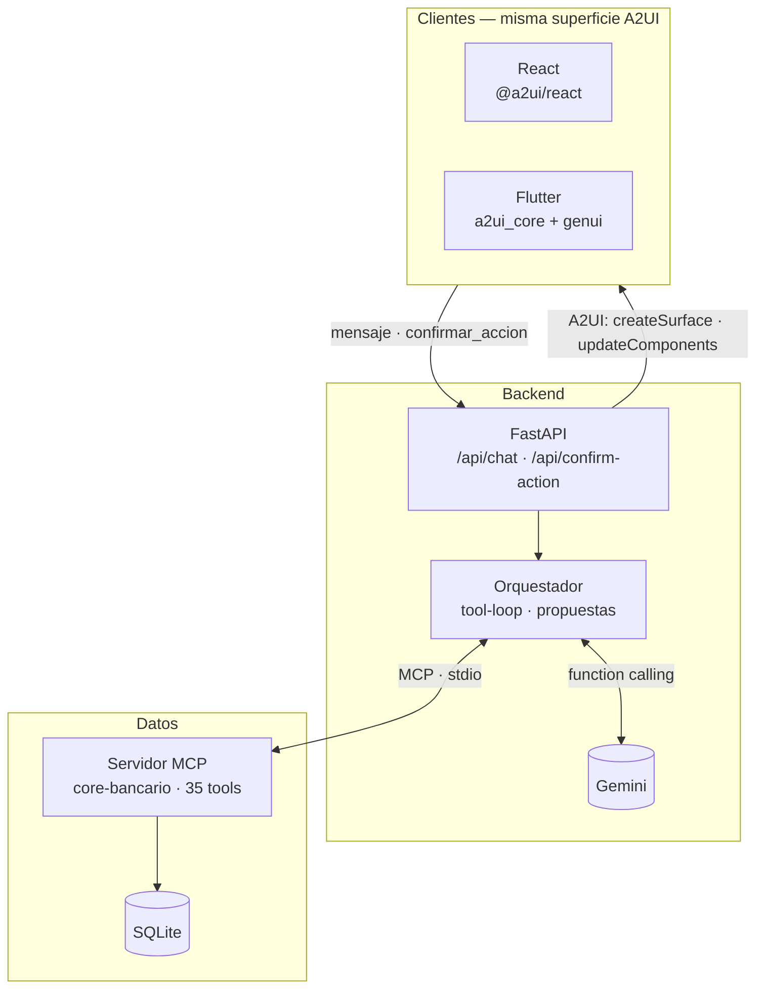
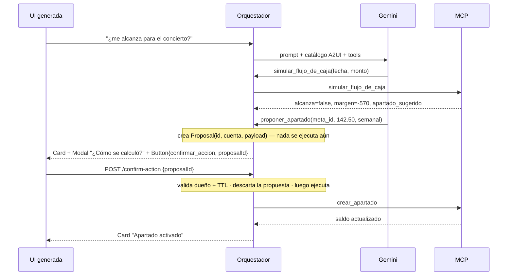

# Me alcanza

**¿Me alcanza para X?** — un agente que no responde con texto: simula tu flujo de caja, te muestra el veredicto en una tarjeta y, si no alcanza, te propone un apartado de ahorro que se activa con un toque. La acción ocurre de verdad en la cuenta.

Reto *Interfaces que la IA construye en tiempo real* — Banorte × Tec de Monterrey, HackMTY 2026.

| | |
|---|---|
| **LLM** | Gemini (`google-genai`), con tool-loop y catálogo A2UI en el system prompt |
| **MCP** | Servidor propio `core-bancario` sobre stdio — 35 tools, SQLite sembrado |
| **A2UI** | Protocolo v0.9 (`a2ui-agent-sdk`); la misma superficie se renderiza en **React** y en **Flutter** |
| **Tests** | 227 en Python (backend + MCP) · 50 en el frontend |

---

## El flujo en 30 segundos

```
Ana escribe:  "¿me alcanza para el concierto del 13 de octubre?"
              │
              ▼
Agente:       get_metas → simular_flujo_de_caja(fecha, $8,000)
              │   saldo $500 · nómina +$12,500 · gastos fijos −$5,570 · margen −$570
              ▼
Tarjeta:      "No alcanza por $570"  ·  ¿Cómo se calculó? (modal con los montos)
              [ Activar apartado: $142.50 semanales × 4 ]  ← Button → confirmar_accion
              │
              ▼  el usuario toca
Backend:      valida la propuesta → crear_apartado (MCP) → descuenta $142.50 del saldo
              │
              ▼
Tarjeta:      "Apartado activado"  — el saldo ya cambió en /api/cuenta
```

El LLM nunca calcula dinero: la simulación es una función pura determinista ([`cashflow.py`](src/me_alcanza/mcp_bank/cashflow.py)). El LLM decide *qué mostrar*; el motor decide *cuánto*.

Segundo flujo: *"deposítale 500 a mi hermano Pepe"* → hay dos "Pepe" → el agente genera **dos tarjetas de confirmación** en el mismo turno y el usuario desambigua tocando la correcta.

---

## Arquitectura



| Capa | Qué hace | Dónde |
|---|---|---|
| Orquestador | Arma el system prompt con el catálogo A2UI, corre el tool-loop (máx. 5 rondas), reescribe `surfaceId` por turno, convierte propuestas en tarjetas | [`orchestrator.py`](src/me_alcanza/backend/orchestrator.py) |
| Propuestas | Toda mutación pasa por *proponer → confirmar*. La propuesta vive en memoria 5 min, atada a la cuenta, y se descarta **antes** de ejecutar (una confirmación doble no ejecuta dos veces) | [`proposals.py`](src/me_alcanza/backend/proposals.py) |
| Servidor MCP | Un proceso aparte, hablado por stdio con el SDK oficial. Cada tool abre/cierra su conexión; los errores de negocio viajan como `ToolError` y llegan al cliente como `400` con el mensaje intacto | [`server.py`](src/me_alcanza/mcp_bank/server.py) |
| Motores | Simulación de flujo de caja, reglas de sugerencias, score de salud — funciones puras sin I/O, testeadas con fixtures sintéticos | [`cashflow.py`](src/me_alcanza/mcp_bank/cashflow.py) · [`sugerencias_engine.py`](src/me_alcanza/mcp_bank/sugerencias_engine.py) |
| Datos | Schema + seed relativo a *hoy* (para que la demo dispare siempre), auth PBKDF2, JWT | [`db.py`](src/me_alcanza/mcp_bank/db.py) · [`auth.py`](src/me_alcanza/backend/auth.py) |

### Cómo cierra el ciclo (proponer → confirmar → mutar)



---

## Correrlo

**Backend** (Python ≥ 3.14, [uv](https://docs.astral.sh/uv/)):

```bash
cp .env.example .env        # GOOGLE_AI_STUDIO_API_KEY, GEMINI_MODEL, JWT_SECRET
uv sync --all-groups
uv run me-alcanza           # http://localhost:8000
```

**Frontend web** (Node):

```bash
cd frontend
cp .env.example .env        # VITE_API_BASE_URL=http://localhost:8000
npm install && npm run dev  # http://localhost:5173
```

**Docker** (backend + frontend, para el homelab):

```bash
docker compose up --build
```

- Backend: puerto `10000`, DB en volumen.
- Frontend: puerto `8080`, servido como estático por nginx.
- `VITE_API_BASE_URL` (en `.env`) se hornea en el build del frontend y
  debe ser una URL que el **navegador** del cliente pueda resolver (IP
  o hostname del homelab, tailnet, etc.) — no `backend`, que solo
  existe dentro de la red de docker compose. Si cambia, hay que
  reconstruir: `docker compose up --build frontend`.
- Para levantar solo uno de los dos: `docker compose up --build backend`
  o `docker compose up --build frontend`.

**Flutter** (Android): `cd flutter_app && flutter run`. El emulador llega al host por `10.0.2.2:8000`; contra el backend público, `--dart-define=API_BASE_URL=https://homelab.tail8dc7f1.ts.net`. Detalle en [`flutter_app/README.md`](flutter_app/README.md).

### Desplegado

| | URL | Cómo |
|---|---|---|
| Frontend | https://frontend.jzackarias.lat/ | nginx en el homelab, detrás de Cloudflare |
| Backend | https://homelab.tail8dc7f1.ts.net/ | uvicorn en el homelab, publicado con Tailscale Funnel (`/docs` tiene el Swagger) |

Por qué así y qué se aceptó a cambio: [ADR 0017](docs/adr/0017-self-hosting-en-homelab-con-docker-compose.md) y [ADR 0018](docs/adr/0018-exposicion-publica-tailscale-funnel-y-cloudflare.md).

### Cuentas demo

| Usuario | Password | Perfil |
|---|---|---|
| `ana` | `pass123` | $500 de saldo, nómina quincenal mañana, 4 gastos fijos en 3–4 días, meta "Concierto" a 32 días, dos contactos "Pepe" |
| `luis` | `pass456` | $8,200, sin ingresos ni gastos programados |

El seed usa fechas **relativas a hoy**: la demo dispara igual el día que sea.

### Qué preguntarle

| Mensaje | Qué genera |
|---|---|
| *¿me alcanza para el concierto del 13 de octubre?* | Veredicto + modal de explicación + botón de apartado |
| *deposítale 500 a mi hermano Pepe* | Dos tarjetas de confirmación (desambiguación por toque) |
| *¿en qué gasté este mes?* | Resumen por categoría (`get_resumen_movimientos`) |
| *agrega a Sofi como contacto, cuenta 5566778899* | Tarjeta de confirmación → `crear_contacto` |

---

## Herramientas MCP

Las 35 tools del servidor se dividen en tres grupos — el LLM **solo ve el primero**.

| Grupo | Tools | Quién las llama |
|---|---|---|
| **Lectura** (el LLM las ve) | `get_saldo` `get_cuenta` `get_resumen_movimientos` `get_ingresos_programados` `get_gastos_fijos` `get_metas` `buscar_contacto` `simular_flujo_de_caja` | Gemini, vía function calling |
| **Mutaciones** (solo tras confirmación) | `ejecutar_transferencia` `crear_apartado` `crear_contacto` `crear_gasto_fijo` `crear_ingreso_programado` `crear_meta` | `confirm_action`, nunca el LLM |
| **Internas** (nunca al LLM) | `autenticar` `get_contacto` `get_movimientos` · CRUD `actualizar_*`/`eliminar_*` · `listar_apartados` `cancelar_apartado` · `generar_y_listar_sugerencias` `marcar_sugerencia` · `calcular_score_salud_financiera` · CRUD de `conversaciones` | Rutas REST de las pestañas *Yo* y *Dashboard* |

El LLM tampoco recibe el detalle crudo de movimientos: solo agregados por categoría. Los `proponer_*` que el modelo invoca son funciones del backend que validan (leyendo del MCP) y crean una `Proposal` — no son tools MCP y no mutan nada.

---

## API REST

| Método | Ruta | Para qué |
|---|---|---|
| `POST` | `/api/login` | JWT (`503` si el MCP no responde, `401` si las credenciales fallan) |
| `POST` | `/api/chat` | `{mensaje, conversacion_id?}` → `{a2ui_messages: [...]}` — sin `conversacion_id` abre un hilo nuevo |
| `POST` | `/api/confirm-action` | `{proposal_id}` → ejecuta y devuelve la tarjeta resultante |
| `GET` | `/api/cuenta` · `/api/movimientos` | Contexto de la pestaña *Yo* |
| `GET/POST/PATCH/DELETE` | `/api/contactos` · `/api/ingresos-programados` · `/api/gastos-fijos` · `/api/metas` | CRUD; `PATCH` hace merge parcial sin corromper con `null` |
| `GET/POST` | `/api/apartados` · `/api/apartados/{id}/cancelar` | Apartados de ahorro |
| `GET/POST` | `/api/sugerencias` · `/{id}/atender` · `/{id}/descartar` | Feed proactivo con historial |
| `GET` | `/api/score-salud-financiera` | Score 0–100 con los factores que lo explican |
| `GET/POST/DELETE` | `/api/conversaciones` · `/{id}/mensajes` | Hilos de chat con memoria (ventana de 10 mensajes) |

Todas las rutas (salvo login) exigen `Authorization: Bearer <jwt>`. Los errores de regla de negocio del MCP se propagan como `400` con el mensaje original.

---

## Decisiones y trade-offs

Cada decisión está registrada como ADR (formato Nygard) en [`docs/adr/`](docs/adr/README.md) — 21 en total, incluyendo hosting, exposición pública, autenticación, memoria de conversación y pruebas. Las que más definen el producto:

| Decisión | Por qué | Costo que aceptamos |
|---|---|---|
| [**El LLM no calcula dinero**](docs/adr/0010-el-llm-no-calcula-dinero.md) — la simulación es una función pura | Un número mal calculado en banca no es un bug, es un incidente. El motor es testeable con fixtures; el LLM no | El modelo necesita instrucciones explícitas de *siempre* llamar la tool |
| [**Proponer → confirmar**](docs/adr/0009-patron-proponer-confirmar.md) para toda mutación | El modelo nunca puede ejecutar una transferencia por su cuenta. La propuesta es un objeto verificable (dueño, TTL, descarte previo a ejecutar) | Un round-trip extra; el usuario siempre toca un botón |
| [**Explicabilidad por componente**](docs/adr/0020-explicabilidad-por-componente.md) — modal *¿Cómo se calculó?* en todo número derivado | El brief pide UI que actúa; un veredicto sin sus entradas no es accionable | Prompt más largo; el modelo a veces omite el modal |
| [**MCP real por stdio**](docs/adr/0006-mcp-como-proceso-separado-sobre-stdio.md), no un registry in-process | Es lo que la pieza MCP del reto exige; el servidor puede reutilizarse desde cualquier cliente MCP | Latencia de proceso; un `banco.db` compartido entre servidor y tests |
| [**A2UI v0.9 con el catálogo básico del SDK**](docs/adr/0011-a2ui-con-catalogo-basico-del-sdk.md) | Priorizamos que el ciclo completo funcionara antes que componentes vistosos | Las tarjetas son genéricas (`Card/Text/Button/Modal`). Componentes de dominio propios — pendiente |
| [**Dos clientes, un solo stream**](docs/adr/0012-dos-clientes-mismo-stream-a2ui.md) (React + Flutter) | Demuestra que la interfaz *viaja*: el backend no sabe quién la renderiza | Cada componente nuevo se paga dos veces; la propuesta LLM bajo cada sugerencia solo está pendiente en Flutter |
| [**Sugerencias proactivas sin LLM**](docs/adr/0019-sugerencias-proactivas-sin-llm.md) | Alertas deterministas que aparecen solas en el Dashboard, sin que nadie pregunte | No es UI generativa; es un feed clásico. Con el seed actual dispara 1 de las 3 reglas |
| [**SQLite + seed relativo a hoy**](docs/adr/0013-sqlite-con-seed-relativo-a-hoy.md) | Cero infraestructura; la demo dispara el mismo escenario cualquier día | No es multi-proceso; suficiente para la demo |
| [**Gemini gratuito, modelo configurable**](docs/adr/0005-gemini-via-google-ai-studio.md) | Function calling estable con el SDK A2UI de Python; costo cero | Cuota del tier gratuito el día del evento — por eso existe el [modo offline](docs/adr/0016-modo-offline-determinista.md) |
| [**El backend solo toca datos vía MCP**](docs/adr/0007-mcp-como-unica-capa-de-datos-del-backend.md), incluso en rutas sin LLM | Una sola frontera de datos y de reglas de negocio | Una llamada IPC por operación; el servidor MCP acumula tools internas |

---

## Estructura

```
src/me_alcanza/
├── backend/
│   ├── app.py            FastAPI + lifespan (levanta el MCP por stdio)
│   ├── orchestrator.py   tool-loop, prompt, propuestas → tarjetas A2UI
│   ├── proposals.py      propuestas en memoria con TTL
│   ├── routes.py         REST
│   ├── fake_provider.py  modo offline determinista
│   ├── dtos.py           pydantic
│   └── mcp_client.py     cliente MCP
└── mcp_bank/
    ├── server.py             35 tools
    ├── db.py                 schema, seed, CRUD
    ├── cashflow.py           simulación determinista
    └── sugerencias_engine.py 3 reglas de detección
frontend/        React + Vite · @a2ui/react
flutter_app/     Flutter · a2ui_core + genui
docs/adr/        21 decisiones de arquitectura (Nygard)
tests/           backend/ (117) · mcp_bank/ (110)
```

Cada feature se construyó con TDD; el *por qué* de cada pieza está en [`docs/adr/`](docs/adr/README.md).

## Tests

```bash
uv run pytest tests/ -q          # 227 — incluye el servidor MCP real por stdio
cd frontend && npm test          # 50
```

Sin red: Gemini se mockea en los tests del orquestador; el MCP se levanta de verdad contra una DB temporal.

---

## Estado

- **Hecho:** afford-check + apartado, transferencia con desambiguación, alta de contactos/gastos/ingresos/metas por chat con confirmación, CRUD REST completo, resumen por categoría, sugerencias proactivas, score de salud, explicabilidad por modal, hilos de conversación con memoria, modo offline de respaldo, dos clientes A2UI, despliegue público.
- **Pendiente:** componentes A2UI de dominio propios (línea de tiempo del flujo de caja, selector de plan de apartado) — [ADR 0011](docs/adr/0011-a2ui-con-catalogo-basico-del-sdk.md). Cerrar el ciclo también para confirmaciones: hoy `confirm_action` devuelve una tarjeta fija sin pasar por el modelo — [ADR 0015](docs/adr/0015-memoria-de-conversacion-por-hilos.md).
- **Riesgo conocido:** el 12 de septiembre los modelos `gemini-*-flash` gratuitos devolvieron `503` por saturación. `GEMINI_MODEL` es configurable y `LLM_PROVIDER=fake` levanta el backend sin API key; ver respaldos en [`frontend/README.md`](frontend/README.md).
